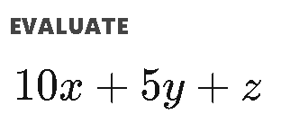
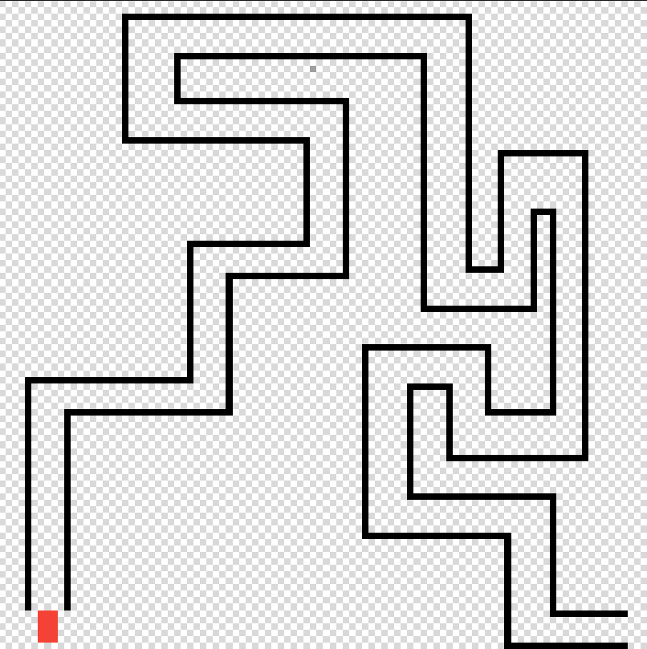
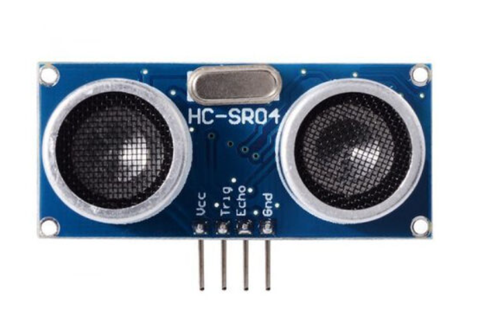

# <center>How Machine Learning Works Simply</center>
#### <center>Author : Erhan Namlı</center>

# <span style="text-align:center">Introduction</span>

Greetings, I created this document to show how you can use ML easily about any topic.

# Setup


```python
import numpy as np
```


```python
import pandas as pd
```


```python
df = pd.DataFrame()
```

Let's create an original dataset, but this dataset must be sensible because of the health of our model.

## Creating a random dataset



x = 10k, y=5k, z=1k

The purpose of our model is to estimate these coefficients and then produce the appropriate result for the parameters given to it.


```python
x = np.random.randint(1,101,1250)
y = np.random.randint(1,101,1250)
z = np.random.randint(1,101,1250)
result=[]
```


```python
for i in range(len(x)):
    result.append(i)
```


```python
for i in range(len(x)-1):
    
    result[i] = x[i]*10 + y[i]*5 + z[i]*1
```


```python
df["x"] = x
df["y"] = y
df["z"] = z
df["result"] = result
```


```python
df
```


<div>
<style scoped>
    .dataframe tbody tr th:only-of-type {
        vertical-align: middle;
    }


</style>
<table border="1" class="dataframe">
  <thead>
    <tr style="text-align: right;">
      <th></th>
      <th>x</th>
      <th>y</th>
      <th>z</th>
      <th>result</th>
    </tr>
  </thead>
  <tbody>
    <tr>
      <th>0</th>
      <td>48</td>
      <td>57</td>
      <td>44</td>
      <td>809</td>
    </tr>
    <tr>
      <th>1</th>
      <td>78</td>
      <td>37</td>
      <td>87</td>
      <td>1052</td>
    </tr>
    <tr>
      <th>2</th>
      <td>78</td>
      <td>29</td>
      <td>22</td>
      <td>947</td>
    </tr>
    <tr>
      <th>3</th>
      <td>91</td>
      <td>20</td>
      <td>75</td>
      <td>1085</td>
    </tr>
    <tr>
      <th>4</th>
      <td>12</td>
      <td>23</td>
      <td>32</td>
      <td>267</td>
    </tr>
    <tr>
      <th>...</th>
      <td>...</td>
      <td>...</td>
      <td>...</td>
      <td>...</td>
    </tr>
    <tr>
      <th>1245</th>
      <td>100</td>
      <td>12</td>
      <td>99</td>
      <td>1159</td>
    </tr>
    <tr>
      <th>1246</th>
      <td>61</td>
      <td>59</td>
      <td>14</td>
      <td>919</td>
    </tr>
    <tr>
      <th>1247</th>
      <td>37</td>
      <td>67</td>
      <td>11</td>
      <td>716</td>
    </tr>
    <tr>
      <th>1248</th>
      <td>30</td>
      <td>57</td>
      <td>11</td>
      <td>596</td>
    </tr>
    <tr>
      <th>1249</th>
      <td>3</td>
      <td>27</td>
      <td>64</td>
      <td>1249</td>
    </tr>
  </tbody>
</table>
<p>1250 rows × 4 columns</p>
</div>


```python
from sklearn.model_selection import train_test_split
from sklearn.linear_model import LinearRegression
```


```python
X = df[['x', 'y', 'z']]
y = df['result']
```


```python
X_train, X_test, y_train, y_test=train_test_split(X,y,test_size=0.1,random_state=13) #train_size=0.8
```


```python
lr=LinearRegression()
regmodel=lr.fit(X_train, y_train)
```


```python
from sklearn.metrics import mean_squared_error,r2_score
```


```python
y_pretest=lr.predict(X_test)
```


```python
r2_score(y_test,y_pretest)
```


    0.9999676121920273


```python
deneme = pd.DataFrame()
```


```python
deneme['x'] = [3]
deneme['y'] = [2]
deneme['z'] = [1]
```


```python
lr.predict(deneme)
```


    array([44.83282925])


# Testing on Real Life Application

Let's say there is a maze and that maze has no fork in the road, and we have a car that has 3 distance sensors. That sensors evaluate right, left, and front obstacle's distance. We can record that distances when deciding which way to turn. 



This is a sensor that evaluates distance between car and obstacle




```python
df2 = pd.DataFrame()
```


```python
right_sensor = np.random.randint(1,255,1500)
left_sensor = np.random.randint(1,255,1500)
front_sensor  = np.random.randint(1,255,1500)
direction=[]
```


```python
for i in range(len(right_sensor)):
    direction.append(i)
```


```python
for i in range(len(right_sensor)):
    
    if front_sensor[i]<100:
        
        if 3*right_sensor[i] < left_sensor[i]:
            
            direction[i] = "LEFT"
            
        elif 3*left_sensor[i] < right_sensor[i]:
            
            direction[i] = "RIGHT"
        else:
            direction[i] = "STRAIGHT"
    else:
        
        direction[i] = "STRAIGHT"
```


```python
df2['right_sensor'] = right_sensor
df2['left_sensor'] = left_sensor
df2['front_sensor'] = front_sensor
df2['direction'] = direction
```


```python
df2
```


<div>
<style scoped>
    .dataframe tbody tr th:only-of-type {
        vertical-align: middle;
    }

    .dataframe tbody tr th {
        vertical-align: top;
    }

    .dataframe thead th {
        text-align: right;
    }
</style>
<table border="1" class="dataframe">
  <thead>
    <tr style="text-align: right;">
      <th></th>
      <th>right_sensor</th>
      <th>left_sensor</th>
      <th>front_sensor</th>
      <th>direction</th>
    </tr>
  </thead>
  <tbody>
    <tr>
      <th>0</th>
      <td>16</td>
      <td>144</td>
      <td>204</td>
      <td>STRAIGHT</td>
    </tr>
    <tr>
      <th>1</th>
      <td>156</td>
      <td>245</td>
      <td>33</td>
      <td>STRAIGHT</td>
    </tr>
    <tr>
      <th>2</th>
      <td>174</td>
      <td>190</td>
      <td>128</td>
      <td>STRAIGHT</td>
    </tr>
    <tr>
      <th>3</th>
      <td>137</td>
      <td>148</td>
      <td>133</td>
      <td>STRAIGHT</td>
    </tr>
    <tr>
      <th>4</th>
      <td>233</td>
      <td>213</td>
      <td>118</td>
      <td>STRAIGHT</td>
    </tr>
    <tr>
      <th>...</th>
      <td>...</td>
      <td>...</td>
      <td>...</td>
      <td>...</td>
    </tr>
    <tr>
      <th>1495</th>
      <td>216</td>
      <td>70</td>
      <td>19</td>
      <td>RIGHT</td>
    </tr>
    <tr>
      <th>1496</th>
      <td>251</td>
      <td>35</td>
      <td>21</td>
      <td>RIGHT</td>
    </tr>
    <tr>
      <th>1497</th>
      <td>36</td>
      <td>64</td>
      <td>183</td>
      <td>STRAIGHT</td>
    </tr>
    <tr>
      <th>1498</th>
      <td>9</td>
      <td>237</td>
      <td>83</td>
      <td>LEFT</td>
    </tr>
    <tr>
      <th>1499</th>
      <td>80</td>
      <td>95</td>
      <td>123</td>
      <td>STRAIGHT</td>
    </tr>
  </tbody>
</table>
<p>1500 rows × 4 columns</p>
</div>


```python
from sklearn.naive_bayes import MultinomialNB
from sklearn.naive_bayes import BernoulliNB
from sklearn.naive_bayes import GaussianNB
from sklearn.metrics import accuracy_score
```


```python
Xdf2 = df2[['right_sensor', 'left_sensor', 'front_sensor']]
ydf2 = df2['direction']
```


```python
x_train,x_test,y_train,y_test=train_test_split(Xdf2, ydf2, random_state=80)
```


```python
x_train
```


<div>
<style scoped>
    .dataframe tbody tr th:only-of-type {
        vertical-align: middle;
    }

    .dataframe tbody tr th {
        vertical-align: top;
    }

    .dataframe thead th {
        text-align: right;
    }
</style>
<table border="1" class="dataframe">
  <thead>
    <tr style="text-align: right;">
      <th></th>
      <th>right_sensor</th>
      <th>left_sensor</th>
      <th>front_sensor</th>
    </tr>
  </thead>
  <tbody>
    <tr>
      <th>919</th>
      <td>166</td>
      <td>201</td>
      <td>140</td>
    </tr>
    <tr>
      <th>1227</th>
      <td>114</td>
      <td>165</td>
      <td>84</td>
    </tr>
    <tr>
      <th>992</th>
      <td>199</td>
      <td>74</td>
      <td>2</td>
    </tr>
    <tr>
      <th>48</th>
      <td>176</td>
      <td>74</td>
      <td>99</td>
    </tr>
    <tr>
      <th>735</th>
      <td>240</td>
      <td>176</td>
      <td>71</td>
    </tr>
    <tr>
      <th>...</th>
      <td>...</td>
      <td>...</td>
      <td>...</td>
    </tr>
    <tr>
      <th>522</th>
      <td>138</td>
      <td>40</td>
      <td>153</td>
    </tr>
    <tr>
      <th>211</th>
      <td>24</td>
      <td>77</td>
      <td>70</td>
    </tr>
    <tr>
      <th>934</th>
      <td>58</td>
      <td>227</td>
      <td>15</td>
    </tr>
    <tr>
      <th>1212</th>
      <td>184</td>
      <td>155</td>
      <td>144</td>
    </tr>
    <tr>
      <th>1199</th>
      <td>177</td>
      <td>186</td>
      <td>248</td>
    </tr>
  </tbody>
</table>
<p>1125 rows × 3 columns</p>
</div>


```python
y_train
```


    919     STRAIGHT
    1227    STRAIGHT
    992     STRAIGHT
    48      STRAIGHT
    735     STRAIGHT
              ...   
    522     STRAIGHT
    211         LEFT
    934         LEFT
    1212    STRAIGHT
    1199    STRAIGHT
    Name: direction, Length: 1125, dtype: object


```python
b=MultinomialNB()
model=b.fit(x_train, y_train)
b_predict=b.predict(x_test)
```


```python
accuracy_score(y_test,b_predict)
```


    0.768


```python
temp = pd.DataFrame()
```


```python
temp['right_sensor'] = [20]
temp['left_sensor'] = [200]
temp['front_sensor'] = [20]
```


```python
b.predict(temp)
```


    array(['LEFT'], dtype='<U8')


